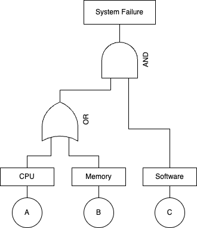
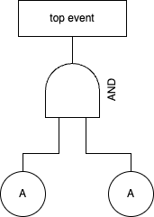
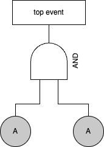

# FaultTree

[](https://travis-ci.com/okamumu/FaultTree.jl)
[](https://codecov.io/gh/okamumu/FaultTree.jl)
[](https://coveralls.io/github/okamumu/FaultTree.jl?branch=master)

FaultTree.jl provides a tool to compute the probability based on fault trees.

## Installation

This is not in the official package of Julia yet. Please run the following command to install it.
```julia
using Pkg;
Pkg.add(PackageSpec(url="https://github.com/JuliaReliab/DD.jl.git"))
Pkg.add(PackageSpec(url="https://github.com/JuliaReliab/FaultTree.jl.git"))
```
The package `DD` is required.

## Load module

Load the module:
```julia
using FaultTree
```

## What is Fault Tree?

The fault tree is a probabilistic model to compute the system failure probability based on the relation between the system failure and component failures. The system failure is placed as the top event, and we write the scenario what are the condition that causes the top event. For example, the system consists of two components, and the system failure occurs only when both components are failed. Then the system failure event is decomposed into two causal events; Each of component is failed. The condition is represented by a combination of logical operatiors such as AND and OR, which are called AND and OR gates. The following figure represents the typical fault tree using AND/OR gates.



In the example, there are three components; CPU, Memory and Software. The system failure occurs in the following cases.

| CPU | Memory | Software | System Failure |
| :-: | :-: | :-: | :-: |
| X | X | X | X |
| X | - | X | X |
| - | X | X | X |
| - | -| X | - |
| X | X | - | - |
| X | -| - | - |
| - | X | - | - |
| - | -| - | - |

One of the advantage of fault tree analysis is to reveal the minimum failure patterns causing the system failure, called the minimal cut sets (MCS). In the example, the MCS are

| CPU | Memory | Software |
| :-: | :-: | :-: |
| X | - | X |
| - | X | X |

Based on the above, we recognize the failure of Software is critical for the system failure.

Also, one of the purpose of fault tree is to compute the occurrence probability of top event. When $p_A$, $p_B$ and $p_C$ are the failure probabilities of CPU, Memory and Software, the probability of system failure becomes
$$
p_S = (1 - (1 - p_A) (1 - p_B)) p_C
$$
This formula is based on the causal relation in the fault tree.

## Drawing a fault tree

The fault tree consists of events and gates. Each gate has several gates and/or events as children. For the time being, the tool can use the following events and gates.

- Events
    - Basic event
    - repeated event
    - Intermediate event
- Gates
    - AND gate
    - OR gate
    - k-out-of-n gate

### Basic event

The basic event is a bottom node of fault tree (leaf node), and represents an event such as a component failure. In the diagram, it can be drawn as a circle. The difference between basic and repeated events appers when the nodes having the same label are placed as two or more leaf nodes. In the case of basic event, they are exactly copied, i.e., the instances of leaf nodes are different. Therefore, even if one event occurs, it does not affect another one that is copied.

For example, we consider the following fault tree having two basic events.



The bottom nodes have the same label A. However, they are different instances. Let $p_A$ be the failure probability of A. Since the probability of system failure is the probability that two components are failed, it becomes $p_S = p_A p_A$.

### Repeated event

The repeated event is a bottom node of fault tree (leaf node), and represents an event such as a component failure. In the diagram, similar to the basic event, it can be drawn as a circle (sometimes, it is distiguished as a coloer). The difference between basic and repeated events appers when the nodes having the same label are placed as two or more leaf nodes. In the case of repeated event, they are exactly same instances. Therefore, when one event occurs, other copied events are also happen.

For example, we consider the following fault tree having two repeated events.



The bottom nodes have the same instance. Let $p_A$ be the failure probability of A. Since the probability of system failure is the probability that one component A is failed, it becomes $p_S = p_A$.

### Intermediate event

The intermediate event is drawn as a rectangle, which is a just label explaning the output of gates. It does not affect the fault tree analysis.

### AND gate

The AND gate represents the causal relation that the parent event occurs when all the child events occur. The shape of AND gate is like a cap whose bottom line is a straight.

### OR gate

The OR gate represents the causal relation that the parent event occurs when any of the child events occurs. The shape of OR gate is like a cap whose bottom line is a curve.  It has two or more child events.

### k-out-of-n gate

The k-out-of-n gate is a generalized gate from AND/OR gates. It is often called the voting gate. The gate has n child events. When k child events are happend, the upper event is also happend. When k equals n, the n-out-of-n gate is same as AND gate. Also, if k is 1, the 1-out-of-n gate becomes OR gate. The shape of k-out-of-n gate is the same as OR gate. It can be distinguished by the label. The following picture shows the 2-out-of-3 gate.


## Building a fault tree

In the tool, the fault tree is built from bottom to up. First we define the events used in the tree:
```julia
@basic A
@repeated B, C
```
The above is the Julia code to define the events. By using macros, we define three events having the symbols `A`, `B` and `C`. The event `A` is the basic event. The events `B` and `C` are the repeated events.

The AND/OR gates can be defined by the common operations of Julia. The operators `&` and `*` correspond to AND gate.
On the other hand, The operators `|` and `+` correspond to OR gate. The code to build the fault tree shown in the presious section is
```julia
top = (A | B) & C
```

## Fault tree analysis

For the fault tree analysis, we first generate the context of fault tree which stores the information on events and BDD:
```julia
ft = FTree()
```
Next we define the environment to store the values (probabilities) of event occurrences. There are two ways to create the environment. First is to use the macro:
```julia
env = @parameters begin
    A = 0.1
    B = 0.3
    C = 0.5
end
```
where A, B, C should be coincide with the symbols of events. In this example, we provide the probabilities 0.1, 0.3, 0.5 to the events A, B, C, and `env` is the identifier of the environemnt. Since the instance of environment is `Dict{Symbol,Tv} where Tv <: Number`, we can make it directly:
```julia
env = Dict(
    :A => 0.1,
    :B => 0.3,
    :C => 0.5
)
```
Note that the key value should be symbols.

By using the context of FT and the environment, we compute the probability of top event:
```julia
prob(ft, top, env)
```

### MCS

We also get MCS of FT as follow.
```julia
mcs(ft, top)
```
These two functions `prob` and `mcs` involve the procedure to make BDD from the given fault tree node. To avoid the redundancy of computation, we can also execute
```julia
x = ftbdd!(ft, top)
prob(ft, x, env)
mcs(ft, x)
```
In the above, the function `ftbdd!` is to create BDD and returns the corresponding BDD node. When a BDD node is used as arguments of `prob` and `mcs`, it can avoid to make BDD. Also, the function `cprob` computes the complement probability of top event.

Finally, we give the example:
```julia
ft = FTree()

@basic A
@repeated B, C

top = (A | B) & C

env = @parameters begin
    A = 0.1
    B = 0.3
    C = 0.5
end

x = ftbdd!(ft, top)
prob(ft, x, env)
mcs(ft, x)
```

### Importance measures

The tool computes the following importance measures:
- `smeas`: Compute S-measure (Structure importance measure)
- `bmeas`: Compute B-measure (Birnbaum imporance measure)
- `c1meas`, `c0meas`: C-measure (Criticality importance measure)

#### S-measure

The function `smeas(ft, top)` computes the structure importance (S-measure) of FT. The result is represented by rational values.
S-measure is defined as the fraction of the number of critical cases over the total number of cases.
The critical case is the case where the system status changes when the status of target component changes.

#### B-measure

The function `bmeas(ft, top, env)` computes the Birnbaum importance (B-measure) of FT.
B-measure is defined as the probability that the system takes critical cases on the target component.

#### C-measure

The function `c1meas(ft, top, env)` computes the criticality importance on 1 (C1-measure) of FT.
C1-measure is defined as the conditional probability that the system takes critical cases in which the target component takes 1
provided that the system takes a status 1. This implies that the contribution of target component to keep the system 1.

The function `c0meas(ft, top, env)` computes the criticality importance on 0 (C0-measure) of FT.
C0-measure is defined as the conditional probability that the system takes critical cases in which the target component takes 0
provided that the system takes a status 0. This implies that the contribution of target component to keep the system 0.

```julia
ft = FTree()

@basic A
@repeated B, C

top = (A | B) & C

env = @parameters begin
    A = 0.9
    B = 0.98
    C = 0.89
end

x = ftbdd!(ft, top)
prob(ft, x, env)
mcs(ft, x)
smeas(ft, top)
bmeas(ft, top, env)
c1meas(ft, top, env)
c0meas(ft, top, env)
```
